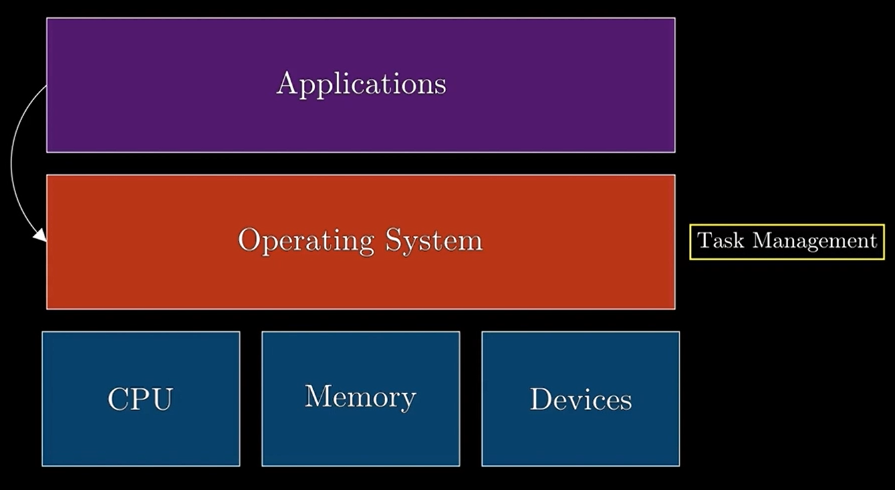
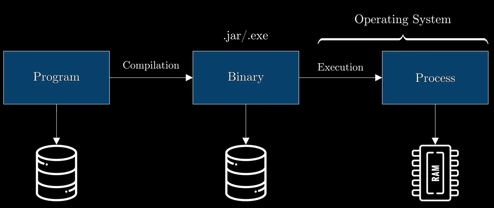
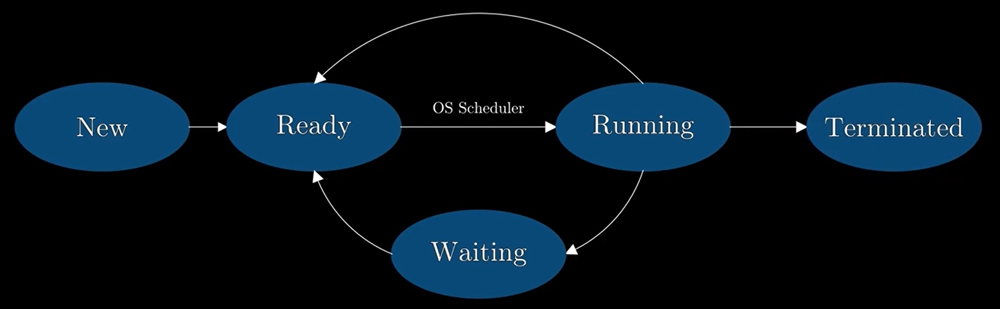
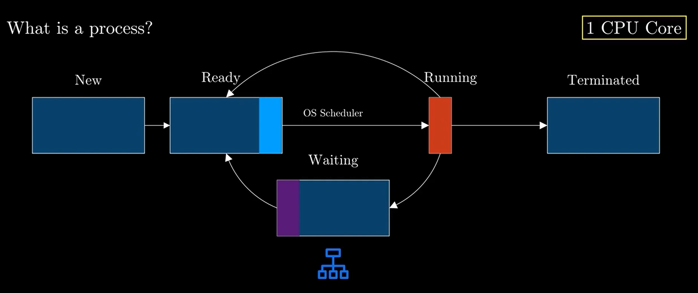
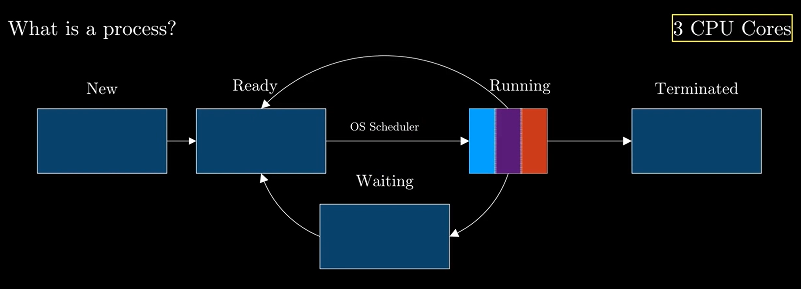
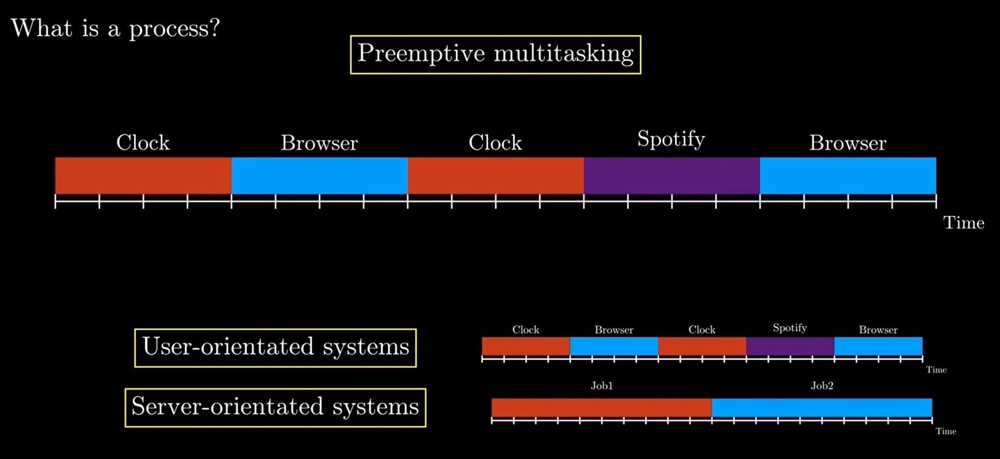
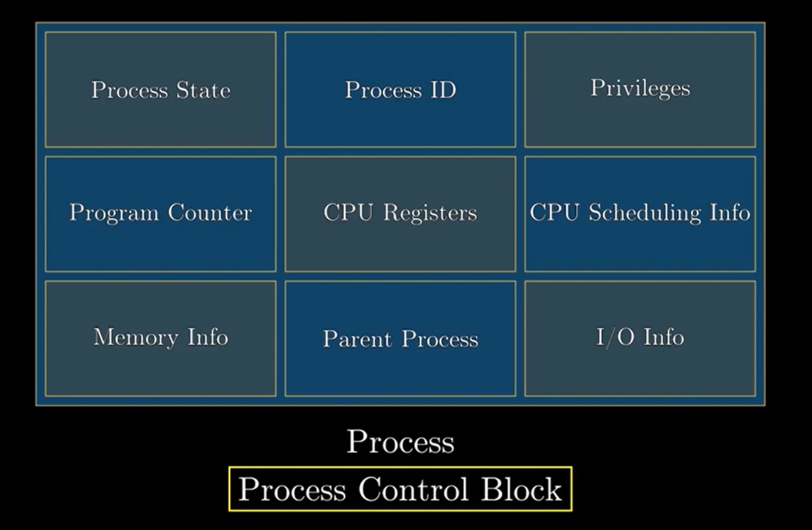

## 📼 Video Summary: What Is a Process? (7 minutes)

This video introduces the concept of a **process** in the context of operating systems and multithreading. A process is
defined as an instance of a program loaded into memory — a key unit of execution managed by the OS.

---

### 🔑 Key Concepts

- **System Architecture Overview:**

    - **Hardware layer** (CPU, memory, peripherals)
    - **Operating system layer** (task manager, security, performance)
    - **Application layer** (user-managed software)

- **Process Definition:**

    - A compiled executable loaded in memory
    - Not active by itself — it's a managed object
    - Represents a unit of work for the OS

> What is a process?
> 
> - A process is an instance of a program loaded into memory
> - A process is a unit of work in an Operating System

- **Process Lifecycle States:**

    - **New → Ready → Running → Waiting → Terminated**
    - Transitions are governed by a **scheduler**
    - **Preemption:** Scheduler forces a process off CPU to give others a turn
    - **Time Slice:** Max time a process can run before switching (e.g., 100ms in Linux)

- **Multicore Consideration:**

    - More CPU cores = more processes running in parallel

    - Higher throughput vs. single-core preemptive multitasking

- **Context Switching:**
    - Swapping between processes — involves saving and restoring process state
    - May introduce performance overhead

- **Process Control Block (PCB):**

    - OS data structure storing process metadata:
        - State, PID, privileges, scheduling priority, memory allocation, CPU register snapshot, file descriptors, etc.

---

### 💡 Practical Implications

- **User-facing OS (e.g., Windows, macOS):**
    - Focuses on responsiveness (more frequent context switches)
- **Server OS (e.g., Ubuntu Server):**
    - Prioritizes throughput (longer process runtimes)

Understanding how a process operates and transitions lays the groundwork for learning about **threads** and how they
work within a process.
