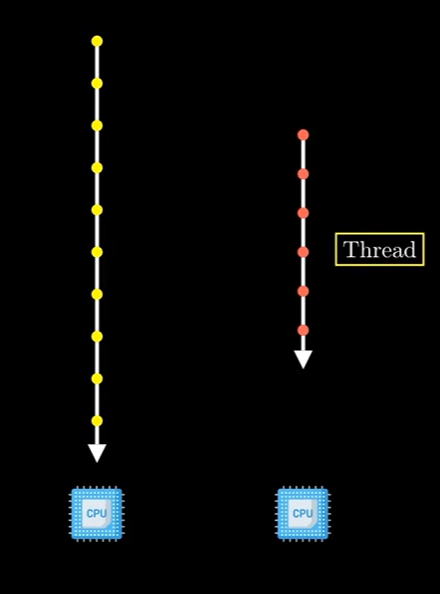
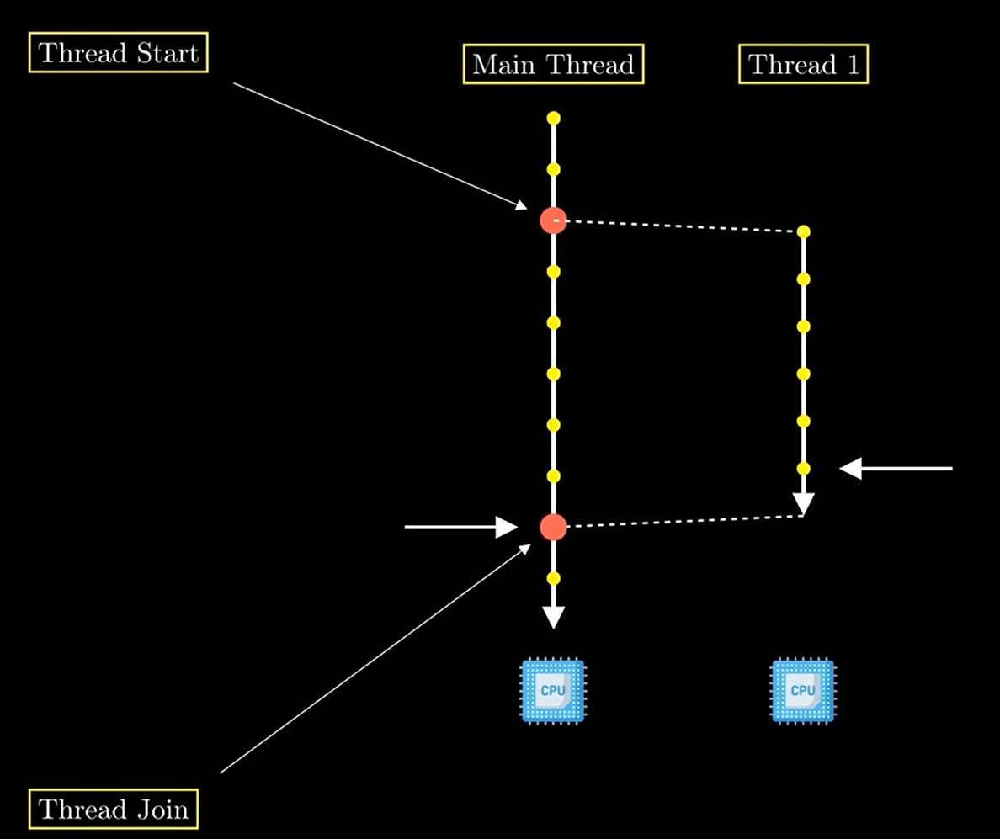
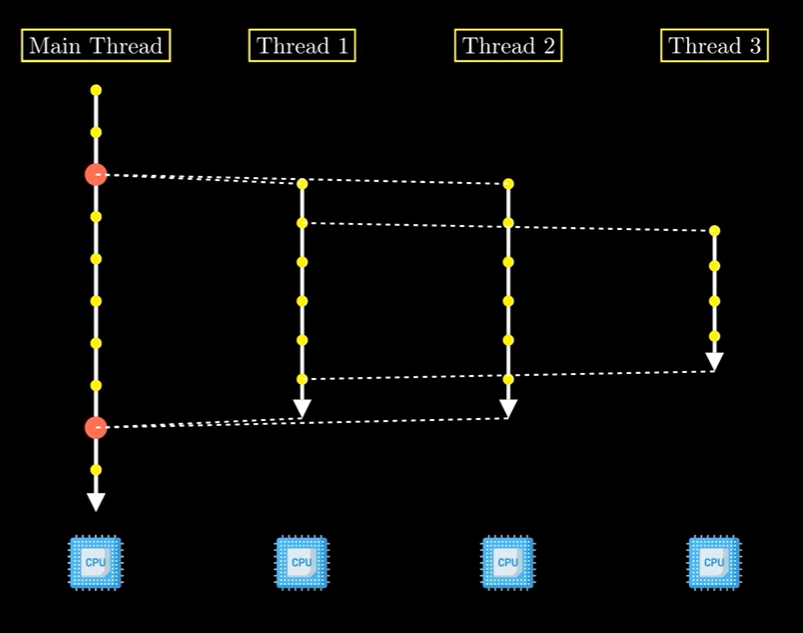
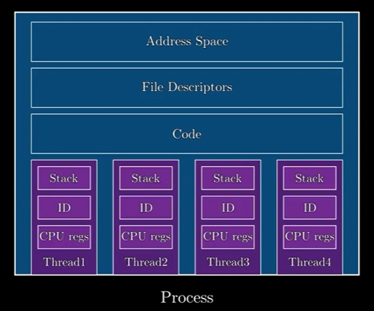
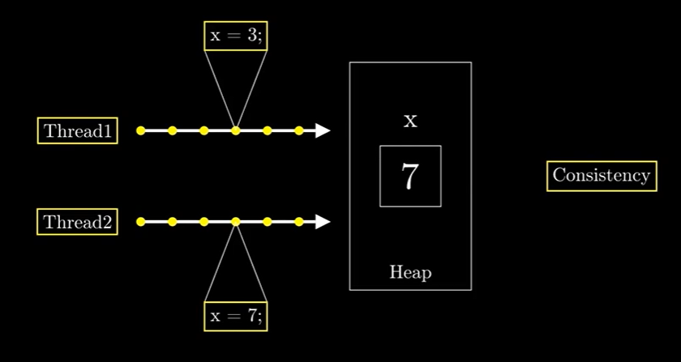
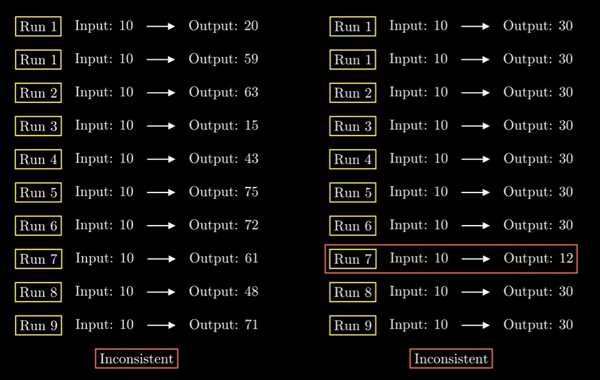

## 📼 Video Summary: What Is a Thread? (4 minutes)

This video builds on the concept of processes by introducing **threads** — the fundamental unit of execution within a 
process. Threads allow multiple sequences of instructions to run concurrently, making them critical for performance in
modern applications.

---

### 🔑 Key Concepts

- **Thread Definition:** 
 
    - A **thread** is a stream of instructions managed by the operating system.
 
    - Every Java application starts with a single thread — the **main thread**.
  
    - Threads enable parallel execution paths in the same program.

- **Thread Lifecycle in Java:**
    1. Program starts in the main thread.
    2. A new thread is created with its own set of instructions.
    3. Both the main thread and new thread execute **in parallel**.
    4. The main thread can use `.join()` to wait for the new thread to finish.

- **Join Operation:**
    - If the main thread reaches `.join()` before the new thread completes, it **blocks** until the new thread finishes.
    - If the new thread completes first, the program continues without delay.

- **Thread Creation:**
    - Threads can be created by both the main thread and other threads, leading to **complex execution graphs**.

---

### 🧬 Threads vs. Processes 
 
- **Belonging:**
    - Threads belong to a **process**.
    - A process must have **at least one thread**, but may spawn many.
    - Killing a process terminates all of its threads.

- **Shared Resources:**
    - Threads in the same process share:
        - Program code
        - File descriptors
        - **Memory address space**

- **Private Resources:**
    - Each thread maintains:
        - A **stack** (for local variables and method calls)
        - A **thread ID**
        - CPU register state

---

### ⚠️ Synchronization Challenge
  
- Because threads share memory, they can **interfere** with each other.
- Example: Two threads modifying the same variable at the same time may result in **inconsistent behavior**.
- **Synchronization** is needed to prevent **race conditions** and maintain **consistency**.

---

### 💡 Takeaway

While threads unlock concurrency and performance, they introduce complexity. **Poor synchronization** can cause 
unpredictable bugs — often subtle and hard to reproduce. Mastery of threading requires precision and discipline in 
resource sharing and control flow management.
